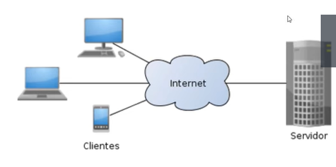

## Docker Fundamentos

## Modelo Cliente-Servidor

O modelo cliente-servidor é uma estrutura de aplicação que distribui as tarefas e cargas de trabalho entre os fornecedores de um recurso ou serviço, designados como servidores, e os requerentes dos serviços, designados como clientes.

## Cloud 

A cloud computing é o acesso sob demanda, via internet, a recursos de computação, como servidores, armazenamento, banco de dados, rede, software, análise e inteligência, sem que haja necessidade de interação humana com cada provedor de serviço.

https://azure.microsoft.com/pt-br/overview/what-is-cloud-computing/

## Virtualização

A virtualização é a criação de uma versão virtual de um dispositivo ou recurso, como um servidor, um dispositivo de armazenamento de dados, uma rede ou até mesmo um sistema operacional, onde os recursos são divididos em um ou mais ambientes de execução.

## Microserviços

Microsserviços são uma abordagem arquitetônica e organizacional do desenvolvimento de software na qual o software consiste em pequenos serviços independentes que se comunicam usanfo API's bem definidas. Esses serviços pertencem a pequenas equipes atosuficientes.

As arquiteturas de microserviços facilitam a escabilidade e agilizam o desenvolvimento de aplicativos, habilitando a inivação e acelerando o tempo de introdução de novos recursos no mercado.

https://aws.amazon.com/pt/microservices/

Hoje, gigantes como Netflix, Amazon, Uber, Twitter, entre outros, utilizam microserviços. E divulgam a receita de sucesso ao transformar seus monolitos em microsserviços.

Quando quebramos uma aplicação monolítica em microsserviços, cada serviço pode ser desenvolvido, implantado, dimensionado, atualizado e gerenciado de forma independente. Cada serviço possui seu próprio processo e pode ser escrito em uma linguagem de programação diferente. Eles podem até mesmo ter sua própria tecnologia de armazenamento de dados.

## O que é um container?

Um container é uma unidade de software que empacota o código e todas as suas dependências para que o aplicativo seja executado de forma rápida e confiável de um ambiente de computação para outro. Um programa de computador, seja ele um serviço, um processo ou uma aplicação, é executado em um ou mais containers.

Os Cônteiners são uma tecnologia usada para reunir um aplicativo e todos os seus arquivos necessários em um ambiente de tempo de execução. Como uma unidade, o contêiner pode ser facilmente movido e executado em qualquer sistema operacional, em qualquer contexto.

https://www.hpe.com/br/pt/what-is/containers.html

## O que é Docker?

Com o Docker, é possivel lidar com os containers como se fossem m´quinas virtuais modeulares e extremamente leves. Além disso, os containers oferecem maior flexibilidade para você criar, implantar, copiar e mover aplicativos de um ambiente para outro. Isso otimiza as aplicações em nuvem (privada e pública).

## Qual é a diferença entre um container e uma máquina virtual?

Os containers são executados diretamente no kernel do sistema operacional (OS) do host. Isso significa que os containers são muito mais leves e rápidos do que as máquinas virtuais (VMs). Você pode executar mais containers em um host do que VMs e, ao mesmo tempo, obter melhor desempenho.

 
