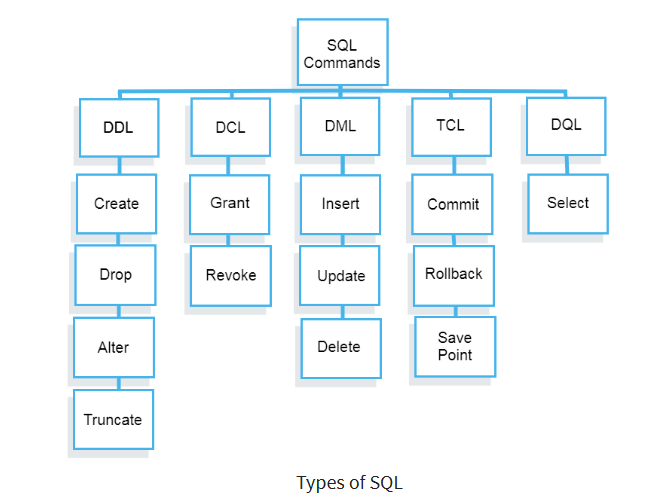

# A linguagem SQL

*SQL (Structured Query Language)* é uma linguagem de banco de dados usada para consulta e manipulação de dados.

#### Tabela - Cliente

id | nome | email | telefone |
--- | --- | --- | --- |
1 | João | joa@gmail | 99999999 |
2 | Maria | maria@gmail | 88888888 |

#### Tabela - Endereço

id | cliente_id | rua | numero | bairro | cidade | estado | cep
--- | --- | --- | --- | --- | --- | --- | --- |
1 | 1 | Rua A | 10 | Centro | São Paulo | SP | 00000000 |3
2 | 2 | Rua B | 20 | Centro | São Paulo | SP | 00000000 |3


## SQL Commands

DDL (Data Definition Language): Comandos para definição de dados.
DCL (Data Control Language): Comandos para controle de dados.
DML (Data Manipulation Language): Comandos para manipulação de dados.
TCL (Transaction Control Language): Comandos para controle de transações.
DQL (Data Query Language): Comandos para consulta de dados.



https://www.guru99.com/sql-commands-dbms-query.html

## Entendendo alguns conceitos

Database: É uma coleção de dados estruturados, agrupados de forma concisa. É composto de tabelas, procedures, views, etc.

Temos deentro dos nossos servidores de banco de dados, vários databases. Por exemplo, podemos ter um database para o sistema de vendas, outro para o sistema de compras, etc.

Comando SELECT

Select: É um comando para consulta de dados. É usado para selecionar dados de um banco de dados.


```sql
SELECT * FROM clientes;
```

Ordenando os resultados - ORDER BY

```sql
SELECT * FROM Clientes 
ORDER BY Nome // Ordena por nome de forma crescente

SELECT * FROM Clientes 
ORDER BY Nome DESC // Ordena por nome de forma decrescente

SELECT * FROM Clientes 
ORDER BY Nome, Sobrenome // Ordena por nome e sobrenome
```

Selecionando colunas específicas

```sql
SELECT Nome, Sobrenome, Email 
FROM Clientes 
ORDER BY Nome, Sobrenome 
```

Utilizando o comando WHERE

```sql
SELECT * FROM Clientes 
WHERE Nome = 'Adam' 
ORDER BY Nome, Sobrenome // WHERE é utilizado para filtrar os resultados

SELECT * FROM Clientes 
WHERE Nome = 'Adam' AND Sobrenome = 'Reynolds'
ORDER BY Nome, Sobrenome // Utiliza o AND para filtrar por mais de uma condição

SELECT * FROM Clientes 
WHERE Nome = 'Adam' OR Sobrenome = 'Reynolds'
ORDER BY Nome, Sobrenome // Utiliza o OR para filtrar por mais de uma condição

SELECT * FROM Clientes 
WHERE AceitaComunicados = 1
ORDER BY Nome, Sobrenomev // Filtra por um campo booleano
```

Utilizando o LIKE

```sql
SELECT * FROM Clientes 
WHERE Nome LIKE 'G%'
ORDER BY Nome, Sobrenome //  LIKE é utilizado para filtrar os resultados por uma string tem que ter o G no inicio e pode ter qualquer coisa depois.

SELECT * FROM Clientes 
WHERE Nome LIKE '%G%'
ORDER BY Nome, Sobrenome //  LIKE é utilizado para filtrar os resultados por uma string pode ter qualquer coisa antes e depois do G, mas que contenha o G.
```

Realizando um INSERT

```sql
INSERT INTO Clientes (Nome, Sobrenome, Email, AceitaComunicados, DataCadastro)
VALUES ('Adriano', 'Andrade', 'email@gmail.com', 1, GETDATE()) // Insere um novo registro na tabela clientes
```	

## Insert otimizando as colunas

```sql
INSERT INTO Clientes 
VALUES ('Adriano', 'Andrade', 'email@gmail.com', 1, GETDATE()) // Insere um novo registro na tabela clientes
```

Neste caso, não passamos as colunas, mas sim os valores. O problema é que se a ordem das colunas mudar, o comando não vai funcionar. Mas desta forma otimizamos o comando.

## Entendendo o conceito de chave primária - PRIMARY KEY

```sql
SELECT * FROM Clientes 
WHERE Id = 1 
```
 O Id é a chave primária da tabela clientes. A chave primária é um campo que identifica de forma única um registro na tabela. Não pode haver dois registros com o mesmo valor de chave primária.

## Realizando um UPDATE

O Update é utilizado para atualizar os dados de um registro.

```sql
UPDATE Clientes
SET Email = 'emailatualizado@gmail.com',
AceitaComunicados = 0
WHERE Id = 1001
```
Neste caso, atualizamos o email e o campo AceitaComunicados para o cliente com o Id 1001.

## Cuidado com o UPDATE

Sempre que for realizar um update, é importante utilizar o where para filtrar os registros que serão atualizados. Caso contrário, todos os registros da tabela serão atualizados.

## Opção de rollback

Com essa opção de rollback, podemos desfazer as alterações realizadas em um comando. Por exemplo, se realizarmos um update, podemos desfazer as alterações realizadas.

```sql
BEGIN TRAN
```
Com esse comando, iniciamos uma transação. A partir deste momento, todas as alterações realizadas no banco de dados serão armazenadas em um log.

Apos realizar as alterações, podemos desfazer as alterações realizadas com o comando:

```sql
ROLLBACK TRAN
```

Com esse comando, desfazemos todas as alterações realizadas no banco de dados desde o momento que iniciamos a transação.

## Criação de uma tabela

```sql
CREATE TABLE Clientes
(
    Id INT PRIMARY KEY IDENTITY(1,1),
    Nome VARCHAR(100) NOT NULL,
    Sobrenome VARCHAR(100) NOT NULL,
    Email VARCHAR(100) NOT NULL,
    AceitaComunicados BIT NOT NULL,
    DataCadastro DATETIME NOT NULL
)
```

## Tipos de dados

#### String Data Types
char(n) - Armazena uma string de tamanho fixo. O tamanho máximo é de 8000 caracteres.
varchar(n) - Armazena uma string de tamanho variável. O tamanho máximo é de 8000 caracteres.
varchar(max) - Armazena uma string de tamanho variável. O tamanho máximo é de 2GB.
text - Armazena uma string de tamanho variável. O tamanho máximo é de 2GB.
ncarchar(n) - Armazena uma string unicode de tamanho variável. O tamanho máximo é de 4000 caracteres.
image - Armazena uma imagem de tamanho variável. O tamanho máximo é de 2GB.

Os mais utilizados são o char e o varchar. O char é utilizado quando o tamanho da string é fixo. Por exemplo, o campo de um CPF. O varchar é utilizado quando o tamanho da string é variável. Por exemplo, o campo de um nome.


#### Numeric Data Types
bit - Armazena um valor booleano. 0 ou 1.
tinyint - Armazena um número inteiro de 0 a 255.
smallint - Armazena um número inteiro de -32,768 a 32,767.
int - Armazena um número inteiro de -2,147,483,648 a 2,147,483,647.
bigint - Armazena um número inteiro de -9,223,372,036,854,775,808 a 9,223,372,036,854,775,807.
decimal() - Armazena um número decimal de -10^38 +1 a 10^38 -1.

Os mais utilizados sao o int,  bit para campos booleanos e o decimal para campos decimais.

#### Date and Time Data Types
date - Armazena uma data no formato YYYY-MM-DD.
time - Armazena uma hora no formato hh:mm:ss.
datetime - Armazena uma data e hora no formato YYYY-MM-DD hh:mm:ss.
datetime2 - Armazena uma data e hora no formato YYYY-MM-DD hh:mm:ss.
smalldatetime - Armazena uma data e hora no formato YYYY-MM-DD hh:mm:ss.
datetimeoffset - Armazena uma data e hora no formato YYYY-MM-DD hh:mm:ss.
timestamp - Armazena uma data e hora no formato YYYY-MM-DD hh:mm:ss.
year - Armazena um ano no formato YYYY.

O datetime2 é o mais recomendado para armazenar datas e horas.


https://www.w3schools.com/sql/sql_datatypes.asp


## Criando uma tabela 

```sql
CREATE TABLE Produtos
(
    Id int IDENTITY(1,1),
    Nome varchar(255) NOT NULL,
    Cor varchar(50) NULL,
    Preco decimal(13,2) NOT NULL,
    Tamanho varchar(10) NULL,
    Genero varchar(1) NULL
)
```

IDENTITY(1,1) - É utilizado para que o campo seja auto incremento. O primeiro valor é o valor inicial e o segundo é o incremento.