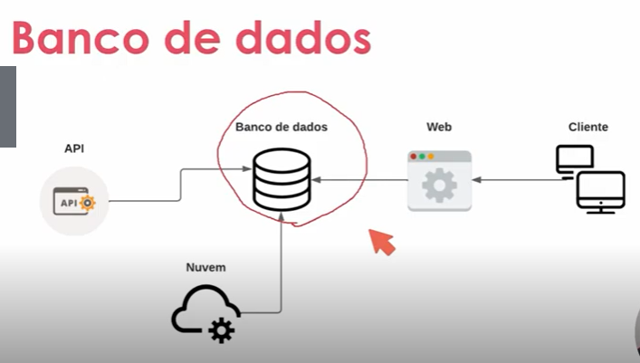
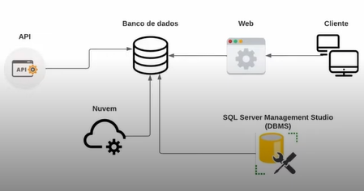

# Banco de dados

Objetivo: Aprender os principais conceitos de dados, SQL, comandos, tratamento e junção de dados, com foco em desenvolvimento.

## Introdução à banco de dados

## Banco de dados definição

Um banco de dados é uma coleção organizada de informações (ou dados) estruturados, normalmente armazenados eletronicamente em um sistema de computador.

https://www.oracle.com/br/database/what-is-database.html



## Tipos de banco de dados

Banco de dados Relacional: O tipo mais usado atualmente armazenado dados estruturados, sendo organizado em tabelas, com colunas e linhas, que se relacionam entre si.

https://www.oracle.com/br/database/what-is-database.html

Exemplos: SQL Server, Oracle, MySQL, PostgreSQL.

Semelhante a uma planilha de excel, onde cada coluna é um campo e cada linha é um registro.

Essas tabelas se relacionam entre si através de chaves primárias e estrangeiras.
Exemplo: Tabela de Clientes e Tabela de Pedidos.

Neste exemplo, a tabela de Clientes é a tabela principal, e a tabela de Pedidos é a tabela secundária. A tabela de Pedidos possui uma chave estrangeira que se relaciona com a chave primária da tabela de Clientes. 

## Entendendo uma tabela

Tabela: São dados estruturados e organizados em formato de linhas e colunas.

Exemplo: Tabela de Clientes

id | nome | email | telefone
1 | João | joao@ | 9999-9999

O id é a chave primária da tabela, ou seja, é o identificador único de cada registro da tabela.

Exemplo: Tabela de Endereços

id | cliente_id | rua | numero | bairro | cidade | estado | cep
1 | 1 | Rua A | 10 | Centro | São Paulo | SP | 00000-000

O cliente_id é a chave estrangeira da tabela, ou seja, é o identificador do registro da tabela de Clientes que está relacionado com o registro da tabela de Endereços.

## Banco de dados não relacional

Banca de dados não relacional: Banco de dados onde os dados são armazenados em tabelas, e sim em armaenados de maneira não estruturadas ou semi estruturadas.

* Mongodb DB que vamos usar no curso

Existem vários tipos: document database, key-value database, wide-column stores, e graph databases.

https://www.mongodb.com/nosql-explained

## Tipos de dados

Estruturados: Dados que possuem uma estrutura definida.

Exemplo: tabela de Clientes

id | nome | email | telefone
1 | João | joao@ | 9999-9999
2 | Maria | maria@ | 8888-8888
3 | José | jose@ | 7777-7777


Semi estruturados: Dados que não possuem uma estrutura definida, mas que possuem uma estrutura mínima.

Exemplo: JSON

```json
{
    "nome": "João",
    "idade": 30,
    "endereco": {
        "rua": "Rua A",
        "numero": 10,
        "bairro": "Centro",
        "cidade": "São Paulo",
        "estado": "SP",
        "cep": "00000-000"
    }
}
```

## DBMS

Database Management System (DBMS): É um software utilizado para acessar, manipular e monitorar um sistema de banco de dados.

SQL Server Management Studio (SSMS): É um DBMS para o SQL Server.



## Instalando o SQL Server