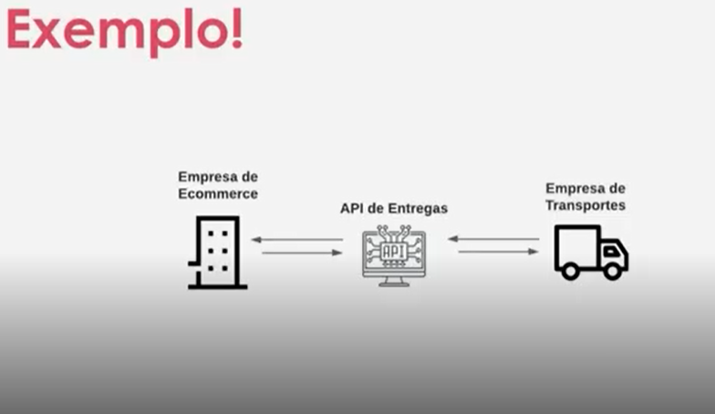

## Introdução as APIs com C#

Uma API(Application Programming Interface) é uma forma de comunicação entre computadores ou programas de computador.

Em outras palavras, é um software que fornece informações para outro software.

O que é uma API?

Analogia Garçom Cliente Cozinha: O cliente faz o pedido para o garçom, o garçom leva o pedido para a cozinha, a cozinha prepara o pedido e o garçom leva o pedido para o cliente.

O Garçom é a API, o cliente é o software que faz a requisição, a cozinha é o software que fornece a informação e o pedido é a informação que o cliente quer.

## Documentação e retorno

A documentação de uma API é muito importante, pois é através dela que o cliente vai saber como fazer a requisição e o que vai receber de retorno. Sempre procure a documentação da API antes de começar a usar.

