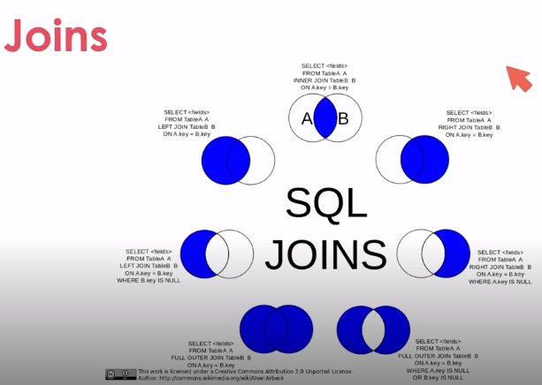

## Manipulando dados

Built-in functions

São funções pré-existentes que auxiliam na manipulação de dados, como por exemplo contar, somar, média, etc.

## Usando o COUNT

O COUNT é uma função que conta a quantidade de linhas de uma tabela ou de um conjunto de dados.

Exemplo:

```sql	
SELECT COUNT(*) FROM [NOME_DA_TABELA]
```
Você também pode usar o WHERE para filtrar os dados que serão contados.

Exemplo:

```sql
SELECT COUNT(*) FROM [NOME_DA_TABELA] WHERE [NOME_DA_COLUNA] = [VALOR]
```

## Usando o SUM

O SUM é uma função que soma os valores de uma coluna.

Exemplo:

```sql
SELECT SUM([NOME_DA_COLUNA]) FROM [NOME_DA_TABELA]
```

Da mesma forma podemos usar o WHERE para filtrar os dados que serão somados.

Exemplo:

```sql
SELECT SUM([NOME_DA_COLUNA]) FROM [NOME_DA_TABELA] WHERE [NOME_DA_COLUNA] = [VALOR]
```

## Usando o MIN, MAX e AVG

O MIN é uma função que retorna o menor valor de uma coluna.

Exemplo:

```sql
SELECT MIN([NOME_DA_COLUNA]) FROM [NOME_DA_TABELA]
```

O MAX é uma função que retorna o maior valor de uma coluna.

Exemplo:

```sql
SELECT MAX([NOME_DA_COLUNA]) FROM [NOME_DA_TABELA]
```

O AVG é uma função que retorna a média dos valores de uma coluna.

Exemplo:

```sql
SELECT AVG([NOME_DA_COLUNA]) FROM [NOME_DA_TABELA]
```

## Concatenando colunas

A concatenação de colunas é uma forma de juntar o conteúdo de duas ou mais colunas em uma única coluna.

Exemplo:

```sql
SELECT [NOME_DA_COLUNA] + ' ' + [NOME_DA_COLUNA] FROM [NOME_DA_TABELA]
```

## Upper e Lower

O Upper e o Lower são funções que alteram o conteúdo de uma coluna para maiúsculo ou minúsculo.

Exemplo:

```sql
SELECT UPPER([NOME_DA_COLUNA]) FROM [NOME_DA_TABELA]
```

## Formatando uma data

O FORMAT é uma função que formata uma data.

Exemplo:

```sql
SELECT FORMAT([NOME_DA_COLUNA], 'dd/MM/yyyy') FROM [NOME_DA_TABELA]
```

## Entendendo o Group By

O Group By é uma cláusula que agrupa os dados de uma consulta.

Exemplo:

```sql
SELECT [NOME_DA_COLUNA] FROM [NOME_DA_TABELA] GROUP BY [NOME_DA_COLUNA]
```

Neste exemplo, o Group By agrupará os dados da coluna [NOME_DA_COLUNA] e retornará apenas um registro de cada valor.

Os comandos sql seguem uma ordem de execução:

Select
From
Where
Group By
Having
Order By

Nem todos os comandos são obrigatórios, mas a ordem de execução é essa.

## Primary Key e Foreign Key

A Primary Key é uma coluna que identifica unicamente cada linha de uma tabela.
A Foreign Key é uma coluna que referencia uma Primary Key de outra tabela.

Exemplo de Primary Key e Foreign Key:

```sql
CREATE TABLE Enderecos(
	Id int PRIMARY KEY IDENTITY(1,1) NOT NULL,
	IdCliente int NULL,
	Rua varchar(255) NULL,
	Bairro varchar(255) NULL,
	Cidade varchar(255) NULL,
	Estado char(2) NULL,
	CONSTRAINT FK_Enderecos_Clientes FOREIGN KEY(IdCliente)
	REFERENCES Clientes(Id)
)
```

No exemplo acima, a tabela Enderecos possui uma coluna chamada ClienteId que referencia a coluna Id da tabela Clientes.

## Realizando um Join

O Join é uma cláusula que une duas ou mais tabelas.

Exemplo:

```sql
SELECT * FROM Clientes
INNER JOIN Enderecos ON Clientes.Id = Enderecos.IdCliente
WHERE Clientes.Id = 4
```

Neste exemplo, a tabela Clientes está sendo unida com a tabela Enderecos através da coluna Id da tabela Clientes e da coluna IdCliente da tabela Enderecos.




