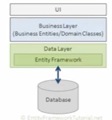

# Introdução

O EF é um framework ORM (Object Relational Mapping) criado para facilitar a integração com o banco de dados, mapeando tabelas e gerendo comando SQL de forma automática.

## Entendendo o CRUD

C - Create (Insert)
R - Read (Select)
U - Update (Update)
D - Delete (delete)

## Verbos HTTP

POST - Create (Insert) 201 
GET - Read (Select) 200
PUT - Update (Update) 405
PATCH - Update (Update) 405
DELETE - Delete (delete) 405

https://developer.mozilla.org/pt-BR/docs/Web/HTTP/Methods

